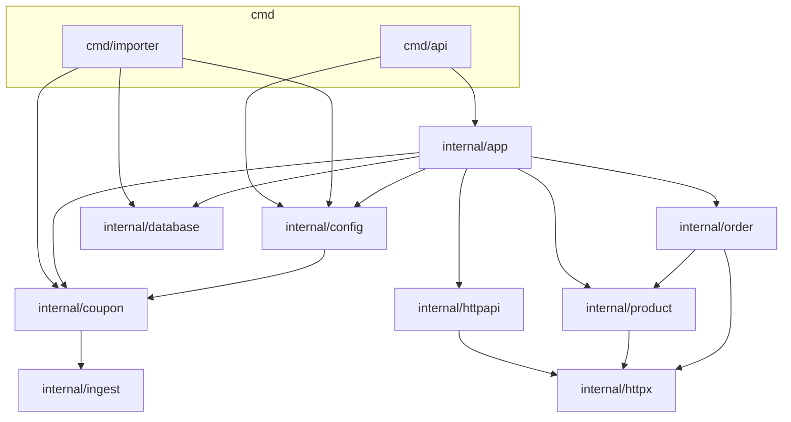
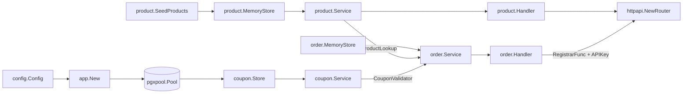
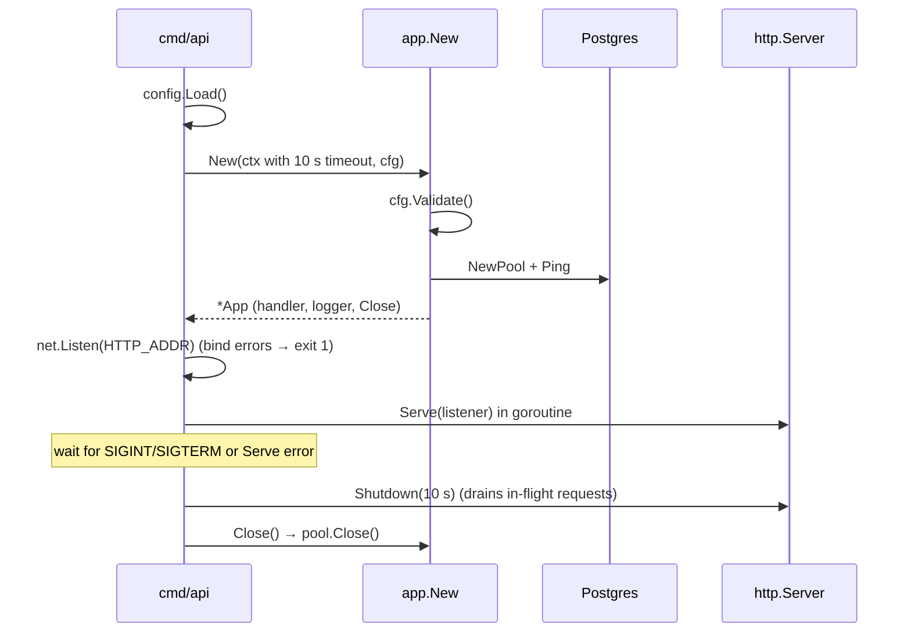
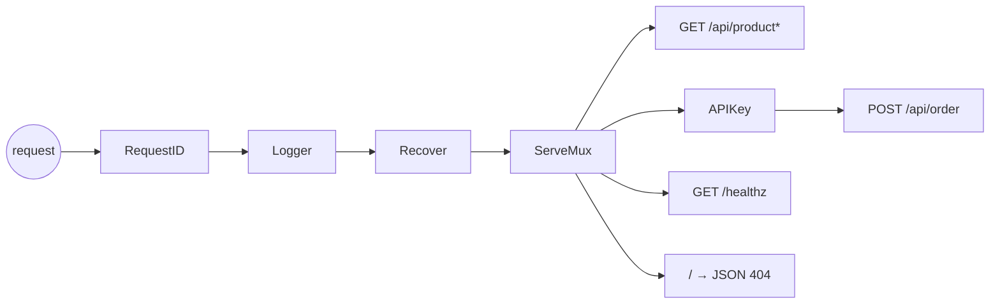
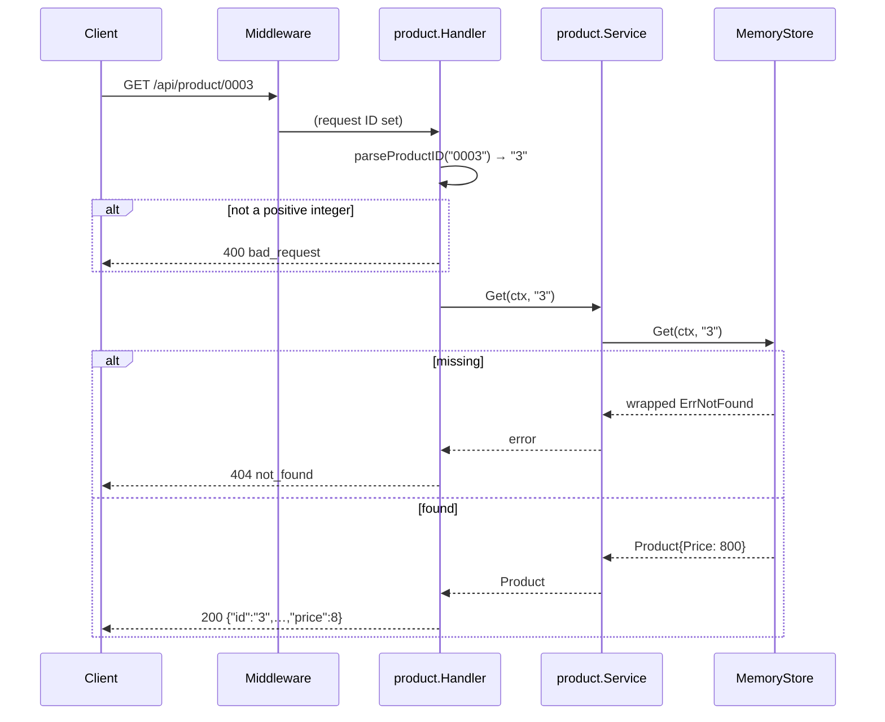
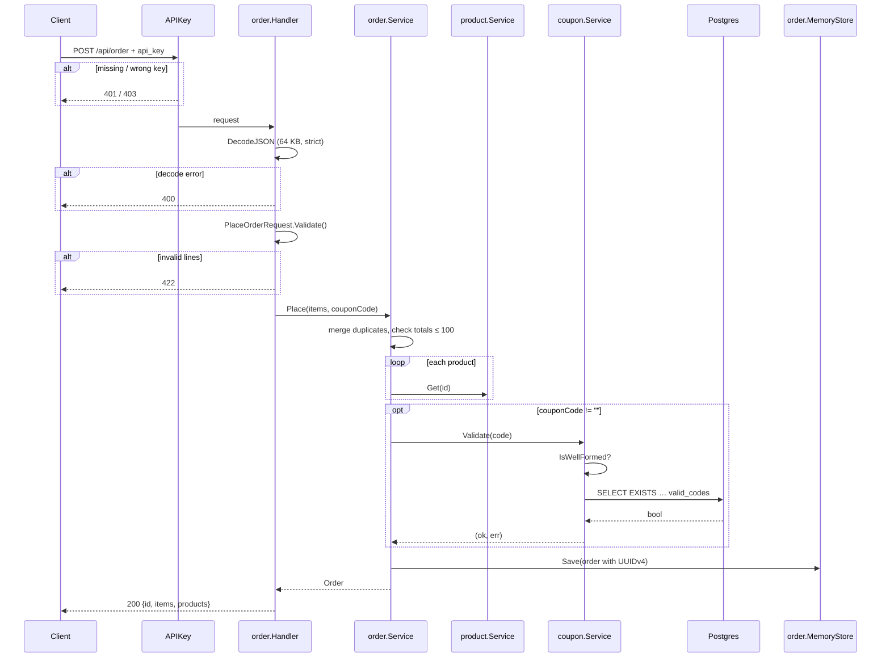
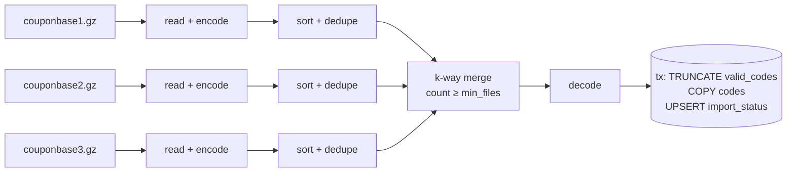
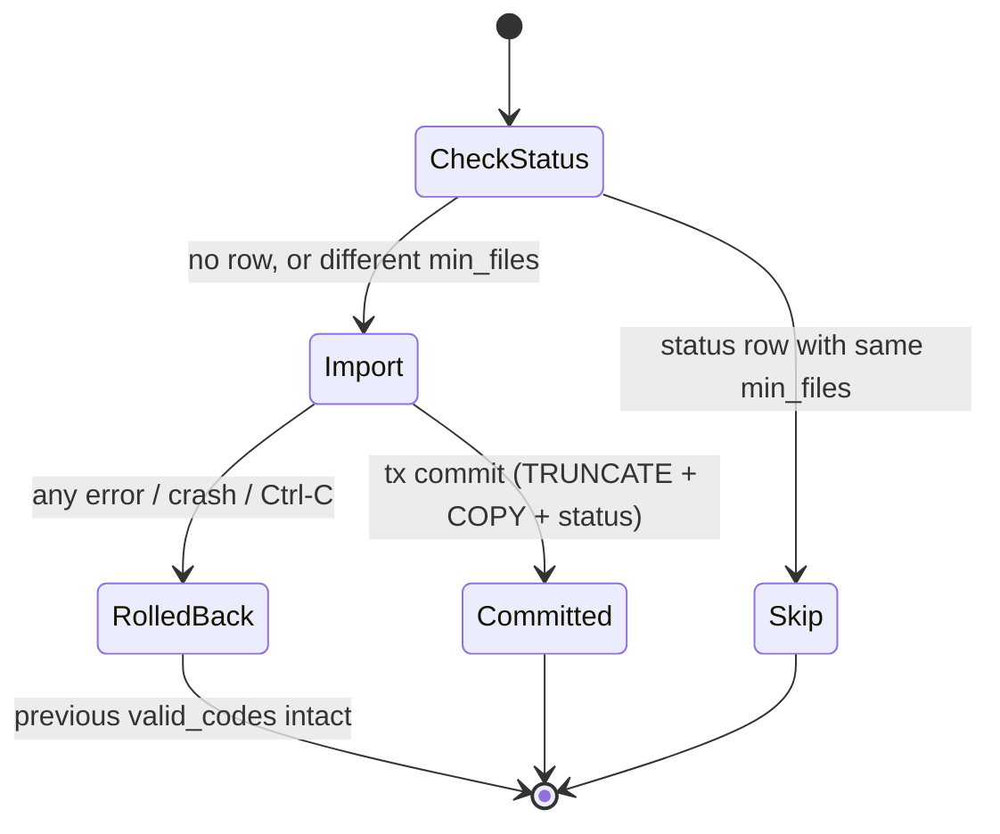

# Low-Level Design — Kart Challenge Backend

This document describes how the backend is built and why. For running,
configuring and calling the service, see the [README](../README.md); for the
chronological history and raw measurements, see [`CODE_LOG.md`](../CODE_LOG.md).

## Contents

1. [Scope](#1-scope)
2. [Architecture](#2-architecture)
3. [Package responsibilities](#3-package-responsibilities)
4. [Composition and lifecycle](#4-composition-and-lifecycle)
5. [HTTP layer](#5-http-layer)
6. [Domains](#6-domains)
7. [Request flows](#7-request-flows)
8. [Coupon importer](#8-coupon-importer)
9. [Data model](#9-data-model)
10. [Error model](#10-error-model)
11. [Concurrency](#11-concurrency)
12. [Security](#12-security)
13. [Design decisions](#13-design-decisions)
14. [Testing strategy](#14-testing-strategy)
15. [Known limitations and future work](#15-known-limitations-and-future-work)

---

## 1. Scope

Two binaries share one Go module (`shop`):

| Binary | Kind | Responsibility |
|---|---|---|
| `cmd/api` | Long-running HTTP server | Products, orders, promo-code validation (read-only lookups) |
| `cmd/importer` | One-shot batch job | Turn three ~1 GB gzip coupon files into the small set of valid codes in Postgres |

The split keeps the expensive, memory-heavy work (≈313M codes) out of the
request path: the API only ever does a primary-key lookup.

Constraints that shaped the design:

- Standard library only for HTTP, JSON, logging and concurrency helpers; `pgx`
  for Postgres and `golang.org/x/sync/errgroup` for the importer.
- The HTTP contract is fixed by `api/openapi.yaml` (field names, paths,
  status codes 200/400/401/403/404/422).
- The coupon rule is data-driven: valid ⇔ length 8–10 **and** present in
  ≥ *N* of 3 files (*N* = `IMPORT_MIN_FILES`, default 2).

## 2. Architecture

### 2.1 Package dependency graph

Arrows point from importer to imported. Domain packages never import
`app`, `httpapi` or `config`, and there are no cycles.



### 2.2 Dependency rules

| Rule | Why |
|---|---|
| `product` and `coupon` import neither `order` nor each other | Domains stay independently testable; only `order` composes others. |
| `order` imports `product` for its **types** only | It needs `product.Product` and `product.ErrNotFound`, never `product`'s store. |
| `order` does **not** import `coupon` | Coupon checking is reached through `order.CouponValidator`, declared in `order`. |
| `httpx` imports no internal package | It is a leaf utility layer for JSON and errors. |
| Only `internal/app` constructs services and stores | One composition root; everything else receives dependencies. |
| `config` may import `coupon` | Solely to reuse `coupon.ParseMinFiles` / `coupon.SourceFiles` for `IMPORT_MIN_FILES`. |

### 2.3 Layering inside a domain

Each domain package (`product`, `order`) has the same file roles:

| File | Contains | Knows about HTTP? |
|---|---|---|
| `<domain>.go` | Domain types (no JSON tags), sentinel errors, constants | No |
| `service.go` | `Service` plus the interfaces it consumes | No |
| `store_memory.go` | In-memory `Store` implementation | No |
| `http_types.go` | Request/response structs (JSON tags), validation, mapping | Yes |
| `handler.go` | `Handler`, status mapping (`statusFor`) | Yes |
| `routes.go` | `Register(mux, …)` | Yes |

Interfaces are declared by the **consumer** (`product.Store` in
`product/service.go`, `order.ProductLookup`/`CouponValidator`/`Store` in
`order/service.go`, `coupon.CodeStore` in `coupon/service.go`,
`httpapi.Registrar` in `httpapi/router.go`). Constructors return concrete
types.

## 3. Package responsibilities

| Package | Responsibility | Key types / functions |
|---|---|---|
| `config` | Read env vars with defaults; validate everything, reporting all errors together | `Config`, `Load() (Config, error)`, `(Config).Validate()`, `SlogLevel()` |
| `database` | Create a pgx pool (max 4 connections) and ping it | `NewPool(ctx, url)` |
| `httpx` | JSON encode/decode helpers; the uniform error body | `APIError`, `WriteJSON`, `WriteError`, `DecodeJSON[T]`, `RequestError`, `MethodNotAllowed` |
| `httpapi` | Router assembly and cross-cutting middleware | `NewRouter`, `Registrar`, `RegistrarFunc`, `RequestID`, `Logger`, `Recover`, `APIKey` |
| `product` | Catalogue: list and get | `Product`, `Service`, `Store`, `MemoryStore`, `Handler`, `ToResponse` |
| `order` | Order placement | `Order`, `Item`, `Service.Place`, `InputError`, `ProductLookup`, `CouponValidator`, `Store`, `MemoryStore`, `Handler` |
| `coupon` | Promo-code rules, lookup, and the import pipeline | `IsWellFormed`, `Service.Validate`, `CodeStore`, `Store`, `Importer`, `Encode`/`Decode`, `SortUnique`, `MergeValid` |
| `ingest` | Allocation-free streaming reader for gzip line files | `Source` (`Scan`, `Bytes`, `LineNumber`; also `pgx.CopyFromSource`) |
| `app` | Composition root for the API | `App`, `New(ctx, cfg)`, `Close()` |

## 4. Composition and lifecycle

### 4.1 Object graph built by `app.New`



`*product.Service` and `*coupon.Service` satisfy `order`'s interfaces
directly (no adapters); compile-time assertions in `app` guard this:

```go
var (
	_ order.ProductLookup   = (*product.Service)(nil)
	_ order.CouponValidator = (*coupon.Service)(nil)
)
```

`app.New` is split from an unexported `newApp(cfg, out, coupons)` that builds
everything except the pool, so tests inject a fake `coupon.CodeStore` and a
log buffer without a database.

### 4.2 API process lifecycle



| Timeout | Value | Purpose |
|---|---|---|
| Startup (connect + ping) | 10 s | Fail fast when the database is unreachable |
| `ReadHeaderTimeout` | 5 s | Slowloris protection |
| `ReadTimeout` | 10 s | Whole request read |
| `WriteTimeout` | 15 s | Whole response write |
| `IdleTimeout` | 60 s | Keep-alive connections |
| Shutdown | 10 s | Drain in-flight requests |

Listening before `Serve` makes a busy or invalid address a synchronous
startup error (exit code 1) instead of a background failure. `App.Close` is
deferred for early returns and also called explicitly after `Shutdown`; pgx's
`Close` is idempotent.

## 5. HTTP layer

### 5.1 Middleware chain



| Middleware | Behaviour | Ordering reason |
|---|---|---|
| `RequestID` | Reuse `X-Request-ID` if printable ASCII, no spaces, ≤ 128 chars; else 16 random bytes → 32 hex chars. Stored in the context and echoed in the response. | Outermost so every later log line has the ID. |
| `Logger` | Wraps the writer in a `statusRecorder`; logs method, path, status, bytes, duration, request ID (level `error` for 5xx). | Outside `Recover` so a recovered panic is logged as 500. |
| `Recover` | Converts a panic to a 500 `APIError` and logs the value with its stack. Re-panics `http.ErrAbortHandler`. Does not write if the response had already started. | Innermost global middleware, closest to handlers. |
| `APIKey` | Per-route (only `POST /api/order`): 401 if the header is missing or empty, 403 if wrong. | Runs before the body is read, so unauthenticated requests never reach JSON decoding. |

`statusRecorder` implements `Unwrap()` so `http.ResponseController` can reach
the underlying writer.

### 5.2 Routing

- Go 1.22 method patterns (`GET /api/product/{productId}`) on
  `http.ServeMux`; `GET` patterns also serve `HEAD`.
- For each known path a **method-less** pattern is registered alongside the
  method-specific one (`/api/product` → `httpx.MethodNotAllowed("GET, HEAD")`).
  The method-specific pattern is more specific, so only other methods reach
  the 405 handler. Without it, the catch-all `/` would turn a wrong method
  into a 404.
- A catch-all `/` returns a JSON 404.
- Domains mount their routes through `httpapi.Registrar`
  (`Register(*http.ServeMux)`), so `httpapi` never imports a domain.
  `order.Handler.Register(mux, protect)` needs the extra middleware argument,
  so `app` wraps it in `httpapi.RegistrarFunc` (the same adapter pattern as
  `http.HandlerFunc`).

### 5.3 Request decoding — `httpx.DecodeJSON[T]`

| Check | Failure → `RequestError.Status` |
|---|---|
| `Content-Type` parsed with `mime.ParseMediaType`; media type must be `application/json` (any parameters such as `charset` allowed) | 415 |
| Body wrapped in `http.MaxBytesReader(maxBytes)` | 413 |
| Empty body (`io.EOF` on first decode) | 400 |
| Syntax error / truncated JSON | 400 (with byte offset when known) |
| Type mismatch (`json.UnmarshalTypeError`) | 400, naming the field and expected type |
| Unknown field (`DisallowUnknownFields`) | 400, naming the field |
| Anything after the first JSON value | 400 |

`DecodeJSON` never writes a response; it returns `*RequestError{Status, Type,
Message}` and the handler decides. The order handler collapses all of these to
**400** because the spec does not list 413/415 for `POST /api/order`.

### 5.4 Response helpers

- `WriteJSON` sets `Content-Type: application/json; charset=utf-8`, writes the
  status, then encodes.
- `WriteError` writes `APIError{code, type, message}` and **replaces any
  status below 400 with 500**, so an error body can never go out with a
  success code.

## 6. Domains

### 6.1 Product

```go
type Product struct { ID, Name string; Price int64 /* cents */; Category string }
```

- **Money** is `int64` cents internally; `product.ToResponse` converts to the
  spec's float (`650 → 6.5`) only at the HTTP boundary. `order` reuses
  `ToResponse`.
- **`MemoryStore`**: `map[string]Product` under `sync.RWMutex`; `List`
  copies under a read lock, then sorts outside the lock. Sort order is
  numeric-aware: numeric IDs compare as integers (`"2"` < `"10"`), non-numeric
  IDs sort after them as strings.
- **ID parsing** (`parseProductID`): digits only (no sign), parsed as a
  positive `int64`, then re-formatted canonically, so `"0007"` resolves to
  product `"7"`; `0`, `-1`, `+1`, `1.5` and int64 overflow → 400.
- **Errors**: store returns `fmt.Errorf("%w: id %q", ErrNotFound, id)`;
  `statusFor` maps `ErrNotFound` → 404, anything else → 500 (logged with the
  request context, generic message to the client).
- Seed data: 9 products, IDs `"1"`–`"9"` (`seed.go`).

### 6.2 Order

```go
type Item  struct { ProductID string; Quantity int }
type Order struct { ID string; Items []Item; Products []product.Product; CouponCode string }
```

Consumed interfaces (declared in `order/service.go`):

```go
type ProductLookup   interface { Get(ctx context.Context, id string) (product.Product, error) }
type CouponValidator interface { Validate(ctx context.Context, code string) (bool, error) }
type Store           interface { Save(ctx context.Context, o Order) error }
```

`Service.Place(ctx, items, couponCode)` algorithm:

1. **Merge** duplicate `productId`s, summing quantities and preserving
   first-seen order (map from ID to index into the output slice; O(n)).
2. **Limit**: any merged quantity > `MaxQuantity` (100) →
   `InputError{ErrQuantityLimit, productId}`.
3. **Resolve products** in merged order. `errors.Is(err,
   product.ErrNotFound)` → `InputError{ErrUnknownProduct, productId}`; any
   other error is wrapped as an internal failure.
4. **Coupon** (only if non-empty): `ok, err := Validate`. `err != nil` →
   wrapped internal failure (500); `!ok` → `InputError{ErrInvalidCoupon,
   code}`.
5. **ID**: UUIDv4 from 16 `crypto/rand` bytes with the version (`0100`) and
   RFC 9562 variant (`10`) bits set.
6. **Save**; failure → wrapped internal failure.

The order of steps is deliberate: cheap local checks first, product lookups
before the coupon (a request with both problems reports the product), and
nothing is saved unless every check passed.

Per-line validation (`PlaceOrderRequest.Validate`: non-empty items, non-empty
`productId`, 1 ≤ quantity ≤ 100, all problems joined) happens in the HTTP
layer before `Place`; the merged-total limit lives in the service because it
is a business rule on the merged order.

`MemoryStore` (`map[string]Order` + `sync.Mutex`) clones the `Items` and
`Products` slices on save (so later caller mutation can't change stored data)
and rejects duplicate IDs.

### 6.3 Coupon (request path)

```go
type CodeStore interface { Exists(ctx context.Context, code string) (bool, error) }

func (s *Service) Validate(ctx context.Context, code string) (bool, error)
```

- `IsWellFormed` (length 8–10) is checked first; malformed codes return
  `false, nil` **without a database query**.
- `Store.Exists` runs `SELECT EXISTS (SELECT 1 FROM valid_codes WHERE code =
  $1)` — a primary-key lookup (~0.3 ms warm).
- Contract: `(false, nil)` means *rejected*; a non-nil error means *the check
  itself failed*. This lets `order` distinguish a 422 from a 500 without
  importing `coupon`.

## 7. Request flows

### 7.1 `GET /api/product/{productId}`



### 7.2 `POST /api/order`



## 8. Coupon importer

### 8.1 Pipeline



The three read→sort branches run concurrently under `errgroup` (the first
error cancels the others via the shared context).

### 8.2 `Importer.Run` steps

| # | Step | Detail |
|---|---|---|
| 0 | Start memory sampler | Polls `runtime.MemStats` every 200 ms; peak `HeapAlloc`/`Sys` logged at the end. |
| 1 | Drop legacy table | If `coupon_codes` exists (earlier design, ~22 GB): `DROP TABLE`, delete its status row, log it. |
| 2 | Ensure schema | `import_status` (+ `ADD/DROP COLUMN IF EXISTS` migrations of older layouts), `valid_codes`. |
| 3 | Idempotency check | Skip if `import_status` has `name='valid_codes' AND min_files = N`. |
| 4 | Read + encode | Per file: stream lines, keep 8–10 char lines, encode to `uint64`; a valid-length line with a non-`[A-Z0-9]` byte **fails the import** with file, line number and content. |
| 5 | Sort + dedupe | `slices.Sort` + `slices.Compact` per file. |
| 6 | Merge | `MergeValid(sets, N)`; per-file slices are then released and `debug.FreeOSMemory()` returns the memory before the database write. |
| 7 | Write | One transaction: `TRUNCATE valid_codes`, `COPY` decoded codes, upsert the status row (`row_count`, `completed_at`, `load_ms`, `min_files`). |
| 8 | Report | Logs per-phase timings, peak memory and relation sizes. |

### 8.3 Streaming reader (`ingest.Source`)

- `gzip.Reader` → `bufio.Reader` (64 KB) → `ReadLine`. Lines longer than the
  buffer (`isPrefix`) are consumed and skipped; they can't be valid codes.
- `bytes.TrimSpace` handles `\r\n` and stray spaces; empty lines are skipped;
  a caller-supplied `keep func([]byte) bool` filters (the length rule).
- `Scan`/`Bytes` expose the line **without allocating** (the slice is valid
  until the next call); `LineNumber` counts physical lines, including
  skipped ones, for error messages. `Next`/`Values`/`Err` additionally
  implement `pgx.CopyFromSource`.

### 8.4 Encoding codes as `uint64`

Each character maps to a base-37 digit that is never zero:

| Characters | Digit |
|---|---|
| `0`–`9` | 1–10 |
| `A`–`Z` | 11–36 |

`value = value·37 + digit` for each character.

- **Lossless and collision-free across lengths**: because no digit is 0,
  `"0000000A"` and `"00000000A"` differ (no implicit leading zeros).
- **Fits**: 37¹⁰ ≈ 4.8·10¹⁵ < 2⁵³ ≪ 2⁶⁴.
- **Order-preserving within a length**: digits follow ASCII order, so numeric
  order equals byte order for equal-length codes (tested).
- **Cost**: 8 bytes per code instead of a ~25-byte Go string, and integer
  comparisons instead of string comparisons.

### 8.5 Merge algorithm

`MergeValid(files [][]uint64, minFiles int) []uint64` walks all sorted slices
in lockstep:

```
loop:
  lowest = min over files of current head        (stop when all exhausted)
  n = number of files whose head == lowest
  advance each such file past every copy of lowest   (duplicates count once)
  if n >= minFiles: append lowest
```

Time O(total · k) with k = 3 files; no hash map (a map of 313M entries would
need > 10 GB). The output is sorted.

### 8.6 Memory profile

- Each per-file slice is pre-sized from the gzip trailer: `ISIZE` (the
  uncompressed size mod 2³²) ÷ (MinLength + 1) is an upper bound on the
  number of kept lines. The slice never grows, avoiding transient 2× copies
  of ~850 MB arrays. (A wrong hint costs memory, never correctness.)
- Peak on the full data: ~2.65 GB heap (three slices live at once).

| File | Lines | Unique |
|---|---|---|
| couponbase1.gz | 107,260,777 | 107,258,700 |
| couponbase2.gz | 107,260,776 | 107,260,726 |
| couponbase3.gz | 98,566,152 | 98,566,151 |

### 8.7 Idempotency and failure behaviour



Because the table swap and the status row share one transaction, the API
never observes a half-written `valid_codes`, and an interrupted import leaves
the previous result in place and retries on the next run.

## 9. Data model

```sql
CREATE TABLE valid_codes (
    code TEXT COLLATE "C" PRIMARY KEY
);

CREATE TABLE import_status (
    name         TEXT PRIMARY KEY,      -- 'valid_codes'
    row_count    BIGINT NOT NULL,
    completed_at TIMESTAMPTZ NOT NULL,
    load_ms      BIGINT,                -- read + sort + merge time
    min_files    INT                    -- rule the rows were computed with
);
```

- `COLLATE "C"` (byte order) is correct for ASCII codes and cheaper than a
  linguistic collation.
- Products and orders are **not** in the database (in-memory stores; see
  [§15](#15-known-limitations-and-future-work)).
- `migrations/` documents the schema history (`001` original layout, `002`
  drop of the per-row `coupon_codes` table). There is no migration runner: the
  importer applies the same statements idempotently (`IF [NOT] EXISTS`).

## 10. Error model

Three kinds of errors, each with a single owner for the HTTP mapping:

| Kind | Type | Produced by | Mapped by |
|---|---|---|---|
| Malformed request | `*httpx.RequestError{Status, Type, Message}` | `httpx.DecodeJSON` | Handler (order: always 400) |
| Client input rejected by the domain | Sentinels (`product.ErrNotFound`, `order.ErrUnknownProduct`, `ErrInvalidCoupon`, `ErrQuantityLimit`), wrapped in `*order.InputError{Err, Value}` | Services | `statusFor` in each handler via `errors.Is` |
| Internal failure | Any other error, wrapped with `%w` and context | Stores, services | Handler → 500 generic message + `ErrorContext` log |

`order.InputError` carries the offending value (product ID or coupon code) and
unwraps to its sentinel. The handler's `clientMessage` builds the 422 text
from **the matched sentinel plus the value only**, never from `err.Error()` of
the chain, so wrapping context (e.g. database details) cannot leak:

```
fmt.Errorf("tx 42 on db-primary: %w", &InputError{ErrInvalidCoupon, "NOPE1234"})
  → 422 "invalid coupon: \"NOPE1234\""
```

| Sentinel | HTTP | `type` |
|---|---|---|
| `product.ErrNotFound` (on `GET /api/product/{id}`) | 404 | `not_found` |
| `order.ErrUnknownProduct` | 422 | `unprocessable_entity` |
| `order.ErrInvalidCoupon` | 422 | `unprocessable_entity` |
| `order.ErrQuantityLimit` | 422 | `unprocessable_entity` |
| anything else | 500 | `internal_error` |

## 11. Concurrency

| Component | Shared state | Protection |
|---|---|---|
| `product.MemoryStore` | product map | `sync.RWMutex` (read-mostly) |
| `order.MemoryStore` | order map | `sync.Mutex` |
| `coupon.Store` | pgx pool | pool is goroutine-safe (max 4 connections) |
| Middleware | per-request only | none needed |
| Importer read phase | one slice per goroutine | no sharing; results written to distinct indices of `sets` before `errgroup.Wait` |
| Memory sampler | peak counters | `sync.Mutex`; stopped via channel before reading |

All tests run clean under `go test -race`.

## 12. Security

| Concern | Measure |
|---|---|
| API key comparison | SHA-256 of the configured key (once) and of the presented key (per request), compared with `subtle.ConstantTimeCompare`; equal-length digests hide both content and length timing. |
| Default credentials | `API_KEY=apitest` is rejected when `APP_ENV=production`. |
| Oversized / hostile bodies | `MaxBytesReader` (64 KB for orders), strict decoding, unknown fields rejected. |
| Slow clients | Read-header/read/write/idle timeouts (§4.2). |
| Log/header injection | Client `X-Request-ID` accepted only if printable ASCII without spaces, ≤ 128 chars. |
| Information leakage | 500s return a generic message; 422 messages contain only the sentinel and the client's own value. |
| Panics | Recovered into 500s with stack traces in the log, not the response. |

## 13. Design decisions

### D1 — Precompute valid codes at import time

Two designs were built and measured on the full data (same laptop):

| | Store every `(code, file_id)`, check at query time | **Store only valid codes (chosen)** |
|---|---|---|
| Import time | 15m15s (first), 8m10s (optimized: C collation, parallel index build, VACUUM) | **32 s** natively, 50 s in Docker |
| Rows stored | 313,087,705 | **8** |
| Disk (table + index) | 13 GB + 9.4 GB | **8 kB + 16 kB** |
| Importer peak memory | small (rows streamed to Postgres) | 2.65 GB |
| Lookup | index-only scan `COUNT(DISTINCT file_id)`, ~1.5–3 ms cold | primary-key lookup, ~0.25 ms |
| Changing the rule | no re-import | re-import (~32–50 s), automatic via `IMPORT_MIN_FILES` |

Both return the same 8 codes (cross-checked with a full `GROUP BY`). The only
advantage of the per-row design — changing the rule without re-importing — is
cheap to give up once a re-import takes under a minute. The cost is RAM at
import time, hence the 4 GB Docker requirement.

### D2 — `uint64` encoding + sort/merge instead of a hash map

A `map[string]int` over 313M codes would need well over 10 GB. Encoded
`uint64` slices need ~2.5 GB, sort in ~12 s per file in parallel, and merge in
one linear pass (§8.4–8.5). An in-place radix sort was considered for the
sort phase and deferred: it is faster in principle, but the gain is seconds
on a job that runs once.

### D3 — `Validate(ctx, code) (bool, error)`

Returning a bool verdict plus an error keeps "rejected" (422) and "could not
check" (500) distinct at the type level, so `order` needs neither an import of
`coupon` nor error-type sniffing. An earlier error-only variant required a
behavioural `InvalidCoupon()` method to make the same distinction and was
reverted.

### D4 — Interfaces at the consumer, concrete constructors

Services depend on small interfaces they declare themselves; implementations
don't know who uses them. `app` is the single place where concrete types meet,
checked at compile time (§4.1).

### D5 — Standard library HTTP

Go 1.22 `ServeMux` patterns cover the routing needs (methods, path
parameters); middleware is plain `func(http.Handler) http.Handler`. No
framework means no transitive dependencies and a small binary.

### D6 — All decode failures are 400 on `POST /api/order`

The spec lists 200/400/401/403/422 for this operation, so 413/415 from
`DecodeJSON` are reported as 400 while keeping the descriptive message.

### D7 — One image, two binaries; importer gates the API

The Dockerfile builds both binaries into one Alpine image. Compose uses
`service_completed_successfully`, so the API only starts once `valid_codes`
is populated; the importer is idempotent, so this costs well under a second
on later starts.

## 14. Testing strategy

| Layer | Technique | Examples |
|---|---|---|
| Pure logic | Table-driven unit tests | encoding round-trips across lengths 8/9/10, merge with `minFiles` 1–3, config validation (all errors reported together) |
| Services | Fakes for the consumed interfaces | `order.Service` with fake product lookup, coupon validator and store (including infrastructure failures that must not become 422s) |
| Handlers | `httptest` through the real mux and middleware | every status in the contract; exact JSON bodies; no error-detail leakage; 500s logged |
| Composition | `newApp` with a fake `CodeStore` | routes mounted, API key enforced, coupon store failure → 500 |
| Importer I/O-free parts | In-memory gzip files | trimming, dedupe, invalid character reported with its line number, capacity hint |
| End-to-end | Docker Compose + curl | real Postgres coupons (valid → 200, invalid → 422), graceful pool shutdown |

## 15. Known limitations and future work

| Item | Impact | Possible fix |
|---|---|---|
| Products and orders are in memory | Lost on restart; order map grows without bound | Postgres-backed stores behind the existing `Store` interfaces |
| Importer mixes pipeline logic with SQL | Harder to unit-test its database steps (coupon package ≈ 44 % covered) | Extract an import store interface; add integration tests behind a build tag |
| Unknown-field detection matches `encoding/json`'s message text | Could break if the standard library changes the wording (a test pins it) | Replace if/when a typed error becomes available |
| No migration runner | `migrations/` is reference only | Adopt a runner if the schema grows beyond the importer's needs |
| Importer validates API-only settings too | `APP_ENV=production` with the default `API_KEY` also stops the importer | Per-binary validation |
| Coupon codes are case-sensitive | `happyhrs` is rejected | Normalise to upper case if the product owner wants that |
| No rate limiting or pagination | Fine for the current catalogue size | Add when catalogue or traffic grows |
